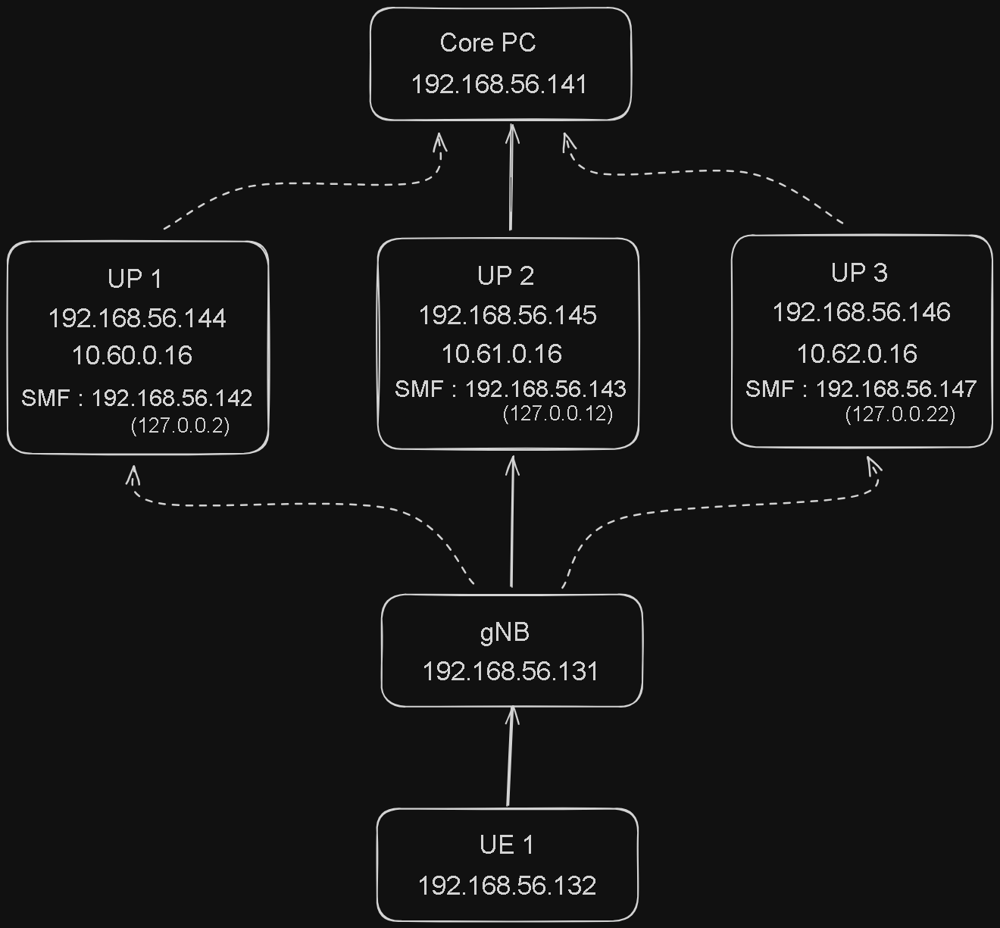
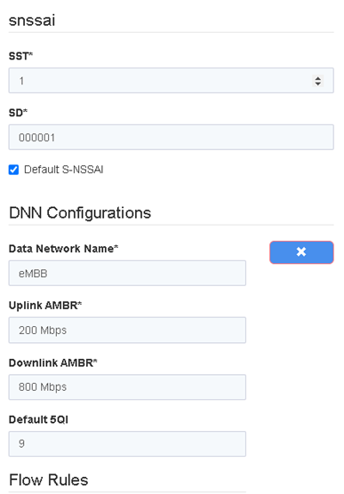
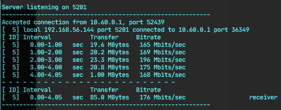
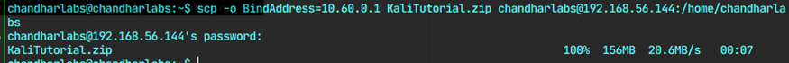
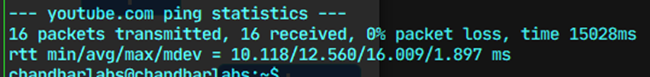
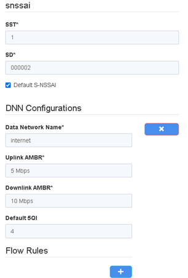
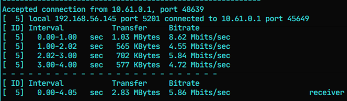
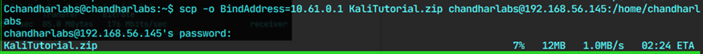
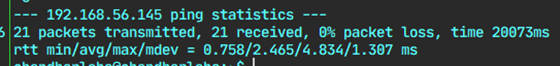

# My Observations from the Simulation

### Setup for 5G Network Slicing Simulation

## Tasks

### 1. When UPF-1 was connected to UE

**Following were the configuration in webconsole set for UPF-1 :**

**Output of iperf3 command :**

**One File was sent from UE to UPF-1 :**

**Latency test :**

### 2. When UPF-2 was connected to UE

**Following were the configuration in webconsole set for UPF-1 :**

**Output of iperf3 command :**

**One File was sent from UE to UPF-1 :**

**Latency test :**

