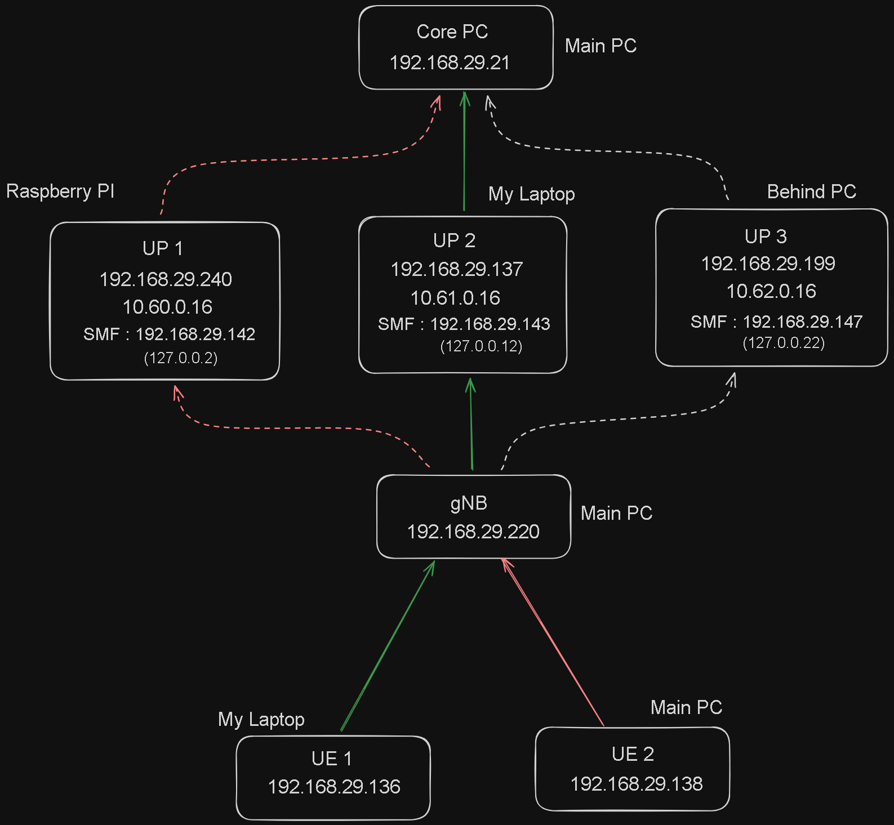
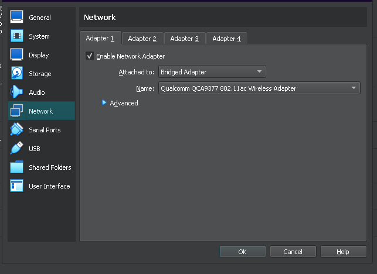

For this simulations, we use VMs from different Host machines, hence some network configurations was required to make the VMs visible on the LAN, so VMs from other PCs can connect (ping) to VMs on another PC.
Also Raspberry Pi was used as a UPF for simulations. For this free5GC was installed on the bare Host OS of the RPI, which gave much more performance advantages and few more network advantages.

> Few problems were faced and resolved while configuring RPI as UPF, this can be viewed here : [[Building New UPF on RPI]]

> After the simulation, the observations has been recorded here : [[ObservationsFromTheSimulation]]

## Setup used for this simulation

During this simulation, two PCs, 1 laptop and one Raspberry Pi were used.  The Core, gNB and UE2 were running on Main PC. UP1 was running on Raspberry Pi, UP-2 and UE-1 were running on Laptop and UP3 was running on Behind PC.

## Process for setting up the environment

1. The basic procedure was simple, which can be easily configured from the previous simulation setup [NetworkSlicingUsing3-UPFs_Setup](https://github.com/tu2-atmanand/5G_Experiments/tree/main/NetworkSlicingUsing3-UPFs_Setup).
2. But you will need to run only the required machines (VMs) on the corresponding Host Machines you are using for the simulation.
3. After the setup as per the configuration files from the previous setup, only the Corresponding IP addresses will need to be changed, by comparing the previous setup and this setup.
4. Also in virtualbox network configuration for each machine will need to be updated, so the machines gets dynamic IP addresses to the network which they are connected to. (Please make sure all the Host machines are connected to same LAN). This can be done as follows :

Disable all other Adapters by unchecking the Enable Network Adapter option. And only keep the Adapter 1 enabled with Bridge Adapter as 'Attached to' option and the 'Name' value will be specific to your Host Machine.

5. After, this updates on all VMs, start the machines with the functions one by one, ie. run the scripts so the respective components of 5G architecture comes online. Run the components in the following order, from the respective VMs and the corresponding Host machines :
1. First UPF by running : 'sudo bash startUPF1.sh'.
2. Second UPF by running : 'sudo bash startUPF2.sh'.
3. Third UPF by running : 'sudo bash startUPF3.sh'.
4. Main 5G Core by running : 'sudo bash start5NRCore.sh'
5. gNB by running : 'sudo bash start5NR-gNB.sh'
6. User Equipmet 1 by running : 'sudo bash startUE1-UPF#.sh' (# - select to which UPF you want your UE to connect so you get the corresponding network allocation, ie. bitrate and latency)
7. User Equipmet 1 by running : 'sudo bash startUE2-UPF#.sh'

6. You can use 'tcpdump' command to capture the pcap files to analyze it in wireshark.
