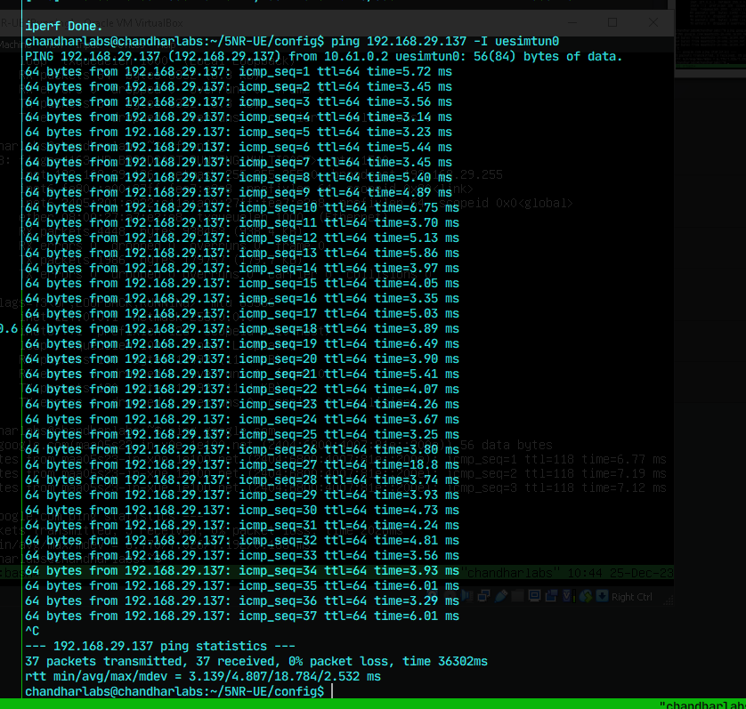
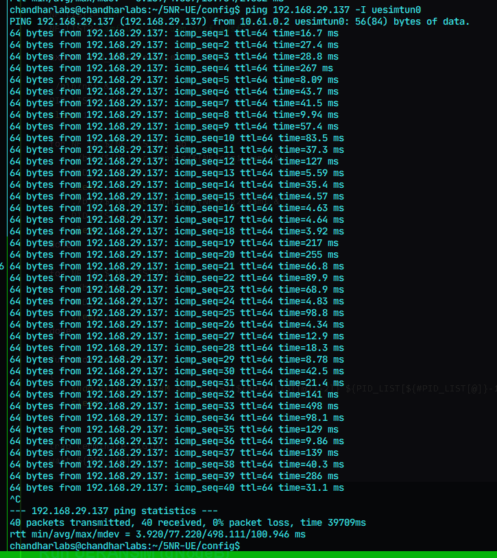
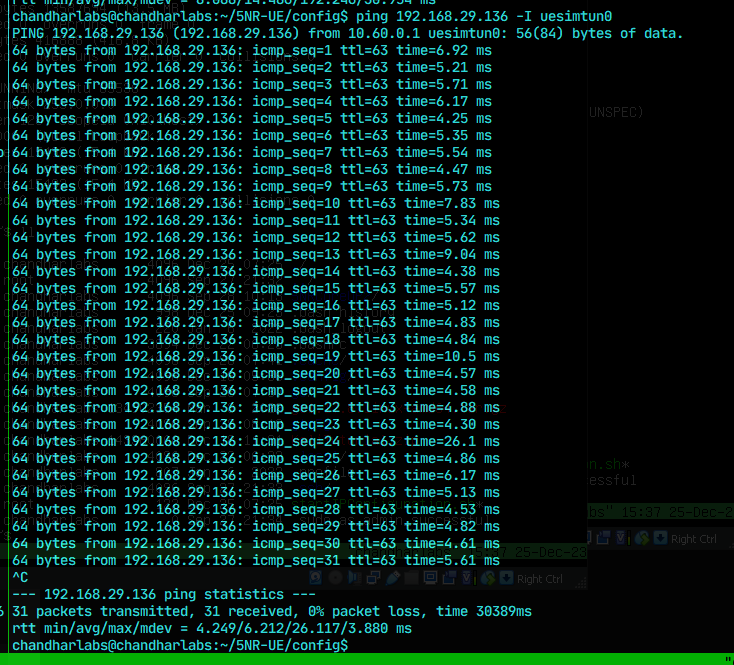

# My Observations from the Simulation

### Setup for 5G Network Slicing Simulation From Different PCs Setup

1. Sometimes the UPF cannot able to provide internet to the UEs connected, since the UPFs are configured on VMs (Guest Machines) and they have some network restrictions.

2. But I was able to access the internet through the tunnel created, when RPI UPF was used, since now the UPF has been configured  on a Host Machine, it has full control over its intenet card, hence it was able to provide the internet to the UEs connected to it through the DN tunnel.

## Latency test from UE-2 to UPF-2

**1. When Kept close**

**2. When moved far away**

> Problem : this is working from UE2 to the UP2 through 10.61.0.2. But the other UE which has been connected
> Solution : Just that the other use has to be created and a new IMSI number is given now both can work simultaneously.

>Problem : Both users cannot communicate with each other through the tunnel, but normally can work

### Latency test from UE-2 to UE-1

**1. When Kept close**

**2. Far away**
